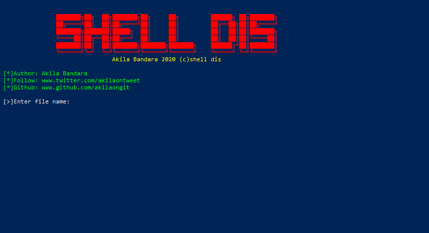

# shelldis
This python programme can open any file in your shell

💻 Preview

This is a simple tool written use Python3.I call it "Shell Dis"😂

Availability
💲Windows10/8/7/vista/xp/etc

Depencies
💲Os
💲Python3

Features
🐬Open any file in your shell...
